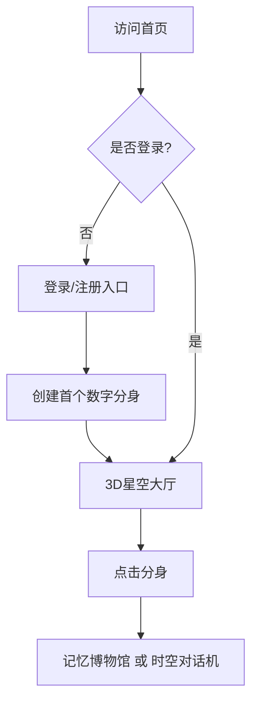
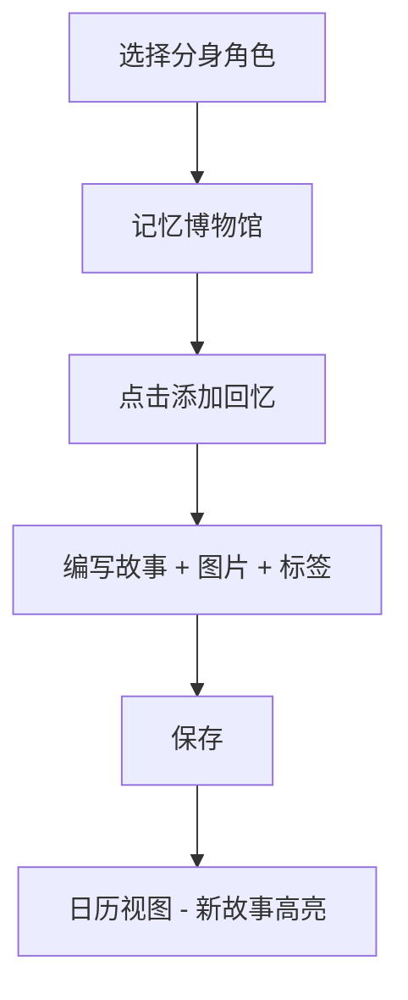
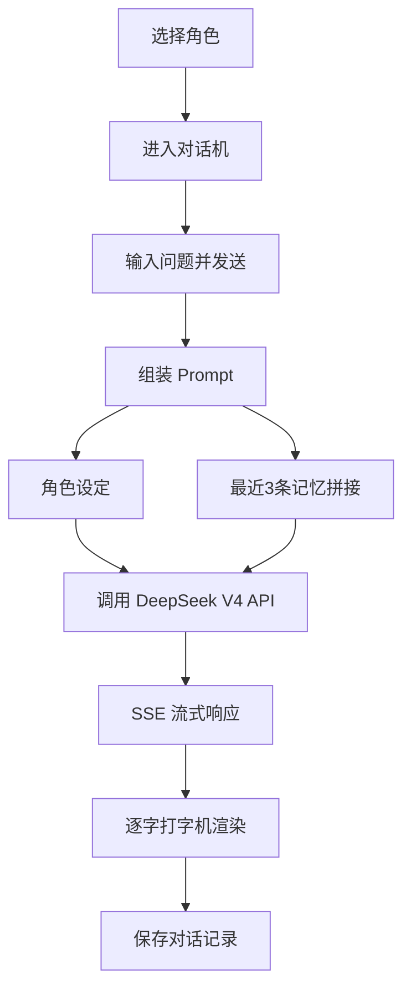
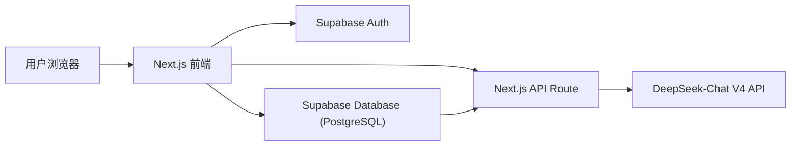
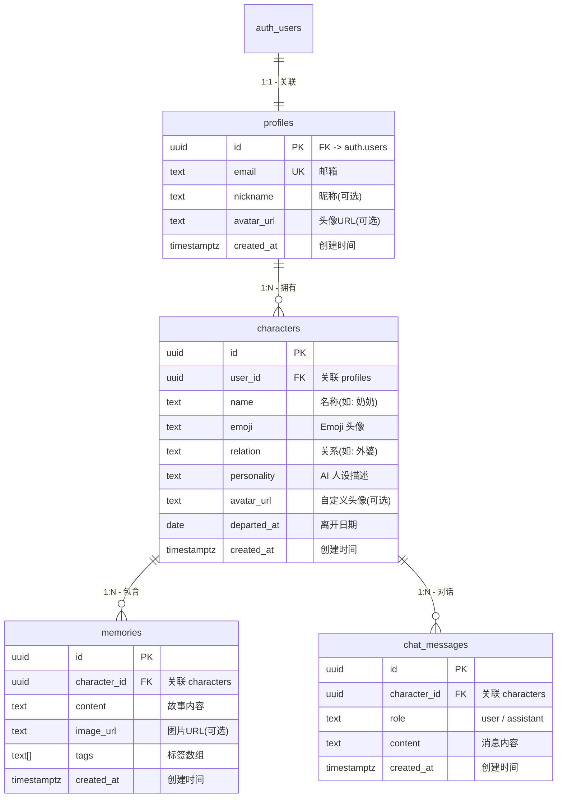

# 🌌 《时空星球》产品需求文档 (PRD)

> **版本**：v1.0
> **创建日期**：2026-06-14
> **负责人**：产品团队

---

## 1. 产品概述

### 1.1 产品定位
《时空星球》是一款**完全私密的数字思念树洞**，为用户提供一个安全、治愈的数字空间，记录离开的亲人或宠物的故事，并与基于大模型的"数字分身"进行跨越时空的对话。

### 1.2 核心价值
| 维度 | 描述 |
|------|------|
| **情感连接** | 通过 AI 技术让思念跨越时空，让记忆得以延续 |
| **绝对私密** | 全站数据加密，仅用户本人可见 |
| **温暖治愈** | 梦幻宇宙视觉风格，强调情感的呼吸感与包裹感 |
| **持续陪伴** | 数字分身 7x24 小时云端在线，随时可倾诉 |

### 1.3 目标用户
- 失去亲人、希望保留与对方情感连接的用户
- 失去宠物、需要一个专属悼念空间的用户
- 对隐私有高度敏感、追求高质量情感体验的用户

### 1.4 市场价值
- 填补情感树洞类产品的 AI 智能化和私密化空白
- 通过 3D 梦幻场景提升情感沉浸感，区别于传统文字日记类产品

---

## 2. 核心功能

### 2.1 用户角色
| 角色 | 注册方式 | 核心权限 |
|------|----------|----------|
| 普通用户 | 邮箱注册登录 | 创建数字分身、编写记忆故事、与数字分身对话 |

### 2.2 功能模块总览
| 模块 | 页面 | 核心功能 |
|------|------|----------|
| 🏠 3D 星空大厅 | `/home` | 自转土星、星轨分身节点、数字分身浮窗 |
| 📖 记忆博物馆 | `/memories` | 日历视图、故事列表、标签云、新增/编辑故事 |
| 💬 时空对话机 | `/chat/[characterId]` | 流式对话、打字机效果、云端在线状态 |
| 👤 个人安全中心 | `/auth` | 邮箱注册、邮箱登录、密码重置 |

### 2.3 页面详情

#### 2.3.1 3D 星空大厅
| 模块名称 | 功能描述 |
|----------|----------|
| 3D 母星 | 高饱和度电光紫(#8B5CF6)、神秘蓝(#3B82F6)与璀璨金(#FFDF00)混合渐变的土星，多层星环结构，缓慢自转 |
| 星轨系统 | 用户创建的数字分身以 Emoji + 名称形式沿多层椭圆星轨飘浮 |
| 星轨交互 | 悬停显示分身高光和离开天数，点击进入该分身的记忆博物馆或对话机 |
| 背景星空 | 深邃夜空渐变背景(#0A0B1E → #121330)，微弱紫色调星云粒子 |
| 底部导航 | 星空大厅 / 记忆博物馆 / 时空对话机 切换按钮 |
| 右上快捷操作 | 新增数字分身按钮（首访引导） |

#### 2.3.2 记忆博物馆
| 模块名称 | 功能描述 |
|----------|----------|
| 角色切换标签 | 顶部横向排列的角色标签（全部/奶奶/小狗/外公...），当前角色高亮 |
| 日历视图 | 主体为月历布局，有记忆的日期显示为发光节点卡片，支持点击查看详情 |
| 右侧信息栏 | 标签云（#思念/#夏天/#围脖...）+ 思念对象列表（显示各角色的故事数量） |
| 故事详情弹窗 | 完整故事内容、图片、标签、操作按钮（编辑/删除） |
| 新增故事 | 右上"添加回忆"按钮，打开编辑器（文本 + 图片 + 标签） |
| 时间显示 | 左上角显示当前年月（如"2026 · 六月"），右上角显示当月故事数量 |

#### 2.3.3 时空对话机
| 模块名称 | 功能描述 |
|----------|----------|
| 角色信息栏 | 左侧显示角色头像 + 名称 + "云端在线"绿点状态，右侧显示"离开的第 N 天"徽章 |
| 对话欢迎语 | 首行显示固定欢迎语"奶奶的数字分身已上线……此刻，时光倒流。" |
| 对话区 | 沉浸式聊天区域，用户消息右侧，AI 回复左侧（带角色头像） |
| 流式回复 | AI 回复逐字打字机效果，呼吸感动画 |
| 输入区 | 底部输入框（placeholder: "对 奶奶 说些什么……"）+ 发送按钮 |
| 底部签名 | 输入框下方小字"AI 生成内容 · 基于你留下的记忆碎片" |
| 角色快速切换 | 导航栏右侧显示已创建角色的圆形头像，点击切换对话对象 |

#### 2.3.4 个人安全中心
| 模块名称 | 功能描述 |
|----------|----------|
| 登录表单 | 邮箱输入、密码输入、登录按钮、"忘记密码"链接 |
| 注册表单 | 邮箱、密码、确认密码、注册按钮 |
| 密码重置 | 邮箱验证码验证 + 重置密码 |
| 安全提示 | 提示"你的所有数据仅你可见"增强信任感 |

---

## 3. 核心流程

### 3.1 首次使用流程

```
用户访问首页 → 检测未登录 → 显示登录/注册入口 → 用户注册 →
创建首个数字分身 → 进入3D星空大厅 → 点击分身 → 进入记忆博物馆
或 选择对话机 → 开始对话
```



### 3.2 记录记忆流程

```
选择角色 → 进入记忆博物馆 → 点击"添加回忆" →
编写故事内容 → 上传图片(可选) → 添加标签(可选) →
保存 → 返回日历视图 → 新故事在对应日期高亮显示
```



### 3.3 时空对话流程

```
选择角色 → 进入对话机 → 输入问题 → 发送请求 →
组装 Prompt（角色设定 + 最近3条记忆）→ 调用 DeepSeek API →
流式接收响应 → 逐字渲染（打字机效果）→ 保存对话记录 →
显示完整对话
```



---

## 4. 用户界面设计

### 4.1 设计风格

| 维度 | 规范 |
|------|------|
| **设计基调** | 梦幻、宇宙、永恒、静谧、安全、治愈 |
| **避免元素** | 冰冷科技感、生硬直线、锐利直角 |
| **强调元素** | 柔和渐变、呼吸感动画、光晕包裹感 |

### 4.2 色彩系统

| 用途 | 颜色 | 十六进制 |
|------|------|----------|
| 背景渐变（深） | 深邃夜空 | `#0A0B1E` |
| 背景渐变（浅） | 深紫夜空 | `#121330` |
| 母星主色 | 电光紫 | `#8B5CF6` |
| 母星辅色 | 神秘蓝 | `#3B82F6` |
| 星环/高光 | 璀璨金 | `#FFDF00` |
| 强调色 | 柔和粉 | `#F472B6` |
| 文字主色 | 高易读白 | `#F5F5F5` |
| 文字辅色 | 淡灰 | `#9CA3AF` |
| 卡片背景 | 半透明玻璃 | `rgba(255,255,255,0.06)` |
| 卡片边框 | 柔和紫边 | `rgba(139,92,246,0.25)` |
| 成功状态 | 柔和绿点 | `#4ADE80` |

### 4.3 字体规范

| 用途 | 字体族 | 大小 | 字重 |
|------|--------|------|------|
| 页面标题 | Inter | 28px | 600 |
| 次级标题 | Inter | 18px | 500 |
| 正文 | Inter | 14-16px | 400 |
| 辅助文字 | Inter | 12px | 400 |
| 数字 | Inter | 24px | 600 |

### 4.4 布局规范

| 规范 | 描述 |
|------|------|
| 布局基础 | 居中卡片式布局 + 左右信息栏 |
| 圆角 | 全部使用 12-16px 圆角，营造柔和感 |
| 间距 | 统一 8/12/16/20/24px 四级间距 |
| 导航 | 底部胶囊式导航，当前页面高亮 |
| 卡片 | 玻璃拟态（半透明 + 柔和边框） |
| 阴影 | 柔和光晕阴影 `0 0 20px rgba(139,92,246,0.15)` |

### 4.5 动效规范

| 效果 | 描述 | 时长 |
|------|------|------|
| 母星自转 | 缓慢匀速旋转，带微弱摆动 | 30s/圈 |
| 星轨运动 | 分身节点沿椭圆轨道缓慢移动，不同轨道速度不同 | 15-25s/圈 |
| 打字机效果 | AI 回复逐字显示，光标闪烁 | 50-80ms/字 |
| 光晕呼吸 | 卡片/按钮光晕明暗交替 | 2.5s/循环 |
| 页面过渡 | 淡入淡出 + 轻微位移 | 300ms |
| 粒子闪烁 | 背景星点随机明暗 | 随机 1-3s/循环 |

### 4.6 图标与 Emoji

| 场景 | 建议 |
|------|------|
| 数字分身头像 | 使用 Emoji（🌟/🐕/👵/👴...）作为默认头像 |
| 功能图标 | 使用 Lucide React 线性图标，统一颜色为淡紫 |
| 装饰元素 | 适当使用 ✨ / 💫 / 🌟 / 🔮 增强宇宙感 |

### 4.7 页面设计概览

| 页面名称 | 模块名称 | UI 元素 |
|----------|----------|----------|
| 星空大厅 | 3D 场景 | 背景：深邃渐变+粒子；中心：紫蓝金渐变土星；星环：多层椭圆轨迹+分身节点；整体：柔和光晕包裹 |
| 记忆博物馆 | 日历视图 | 顶部：角色胶囊标签切换；主体：网格月历卡片，有故事日期带光晕；右侧：标签云+对象列表 |
| 时空对话机 | 对话界面 | 顶部：角色信息栏+离开天数徽章；主体：渐变背景气泡对话区；底部：柔和玻璃输入框 |
| 个人安全中心 | 认证表单 | 居中玻璃拟态卡片；柔和渐变背景；按钮带发光效果 |

### 4.8 响应式设计

| 断点 | 宽度范围 | 布局策略 |
|------|----------|----------|
| 桌面（默认） | ≥ 1280px | 完整三列布局（3D场景 + 信息栏 + 操作区） |
| 平板 | 768 - 1279px | 两列布局，右侧信息栏折叠为浮动面板 |
| 移动 | < 768px | 单列布局，3D 场景简化为静态渐变背景，底部导航固定 |

---

## 5. 3D 场景设计规范

### 5.1 环境与氛围
- **背景**：深邃渐变夜空 `#0A0B1E` → `#121330`，带微弱紫色调
- **星云粒子**：1000+ 个随机分布光点，20% 带有轻微闪烁动画
- **光晕**：土星周围有柔和紫色光晕 `#8B5CF6` 透明度 15%

### 5.2 光照设置
```
- 主光源 (Key Light): 方向光，角度 45°，颜色 #FFDF00（柔和金色），强度 1.2
- 补光 (Fill Light): 环境光，颜色 #8B5CF6（紫色），强度 0.4
- 轮廓光 (Rim Light): 点光源，位于土星后上方，颜色 #3B82F6（蓝色），强度 1.5
- 自发光: 土星表面材质带 emissive，颜色 #8B5CF6 强度 0.3
```

### 5.3 摄像机设置
- **视角**：PerspectiveCamera 60° FOV
- **距离**：距土星中心约 8-10 单位
- **观察角度**：俯视 20°，可轻微随鼠标移动做视差
- **运动**：缓慢绕 Y 轴摆动，增加呼吸感

### 5.4 场景构成元素

| 元素 | 技术实现 | 动画 |
|------|----------|------|
| 土星本体 | SphereGeometry + ShaderMaterial 或 Canvas 纹理，多层渐变（紫/蓝/金） | 自转 + 微弱 Y 轴浮动 |
| 星环 | RingGeometry（多层叠加），透明材质，金色/紫色纹理 | 同土星自转方向但略慢 |
| 分身节点 | InstancedMesh 或多个独立 Sphere，Emoji 贴图/纹理 | 沿各自椭圆轨道移动 |
| 轨道线 | Line 或 CircleGeometry 绘制的椭圆，透明度 30% | 静态或轻微闪烁 |
| 粒子系统 | Points + ShaderMaterial | 随机闪烁 |

### 5.5 交互动画
- **悬停**：悬停分身节点时，节点放大 1.3 倍，光晕增强
- **点击**：点击后分身向中心汇聚或做扩散动画，页面渐隐切换
- **视差**：鼠标移动时，场景整体做轻微偏移，增强 3D 感

### 5.6 后处理效果
- **Bloom 泛光**：使金/紫色光源产生柔和光晕
- **UnrealBloomPass** 阈值 0.3，强度 0.6
- **无 TonalMap**，保持暗部细节
- **抗锯齿**：FXAA 或 MSAA

### 5.7 性能预算
- 总粒子数 ≤ 2000
- 渲染帧率 ≥ 30fps（移动）/ ≥ 60fps（桌面）
- 3D 资源总大小 ≤ 500KB（程序化生成，不依赖外部贴图）

---

## 6. 技术架构

### 6.1 整体架构



### 6.2 技术栈说明

| 层 | 技术 | 版本/说明 |
|----|------|----------|
| **前端框架** | Next.js | 14.2.x + App Router |
| **前端语言** | TypeScript | 5.x |
| **样式方案** | Tailwind CSS | 3.4.x |
| **动效方案** | Framer Motion | 10.x |
| **3D 渲染** | Three.js + @react-three/fiber + @react-three/drei | latest |
| **图标库** | Lucide React | 1.x |
| **后端/数据** | Supabase | PostgreSQL + Auth |
| **AI 服务** | DeepSeek-Chat V4 | Chat Completions API |
| **部署** | Vercel | 一键部署 |

### 6.3 架构原则
1. **前后端分离但同域**：使用 Next.js API Route 封装 DeepSeek 调用，避免跨域问题
2. **数据只走 Supabase**：认证、数据库、存储统一使用 Supabase SDK
3. **仅后端持有 API Key**：DeepSeek API Key 仅存储在服务端环境变量
4. **3D 场景全程序化生成**：不依赖外部模型文件，降低加载成本和依赖

### 6.4 路由定义

| 路由 | 页面 | 说明 |
|------|------|------|
| `/` | 首页（重定向） | 根据登录状态跳转至登录页或大厅 |
| `/home` | 3D 星空大厅 | 主页面，展示 3D 宇宙场景和分身 |
| `/memories` | 记忆博物馆 | 日历视图，编写和查看记忆故事 |
| `/chat/[characterId]` | 时空对话机 | 与指定数字分身对话 |
| `/auth` | 个人安全中心 | 登录/注册/密码重置 |
| `/api/chat` | 后端 API | 流式对话接口（POST） |

### 6.5 API 定义

#### 6.5.1 流式对话接口

**路径**：`POST /api/chat`

**请求体类型定义**：

```typescript
interface Message {
  role: 'user' | 'assistant' | 'system';
  content: string;
}

interface ChatRequest {
  messages: Message[];           // 对话上下文（不含 system）
  personality?: string;          // 角色性格描述（用于 system prompt）
  memories?: string[];           // 相关记忆片段（可选）
  characterId?: string;          // 角色 ID（用于记录到数据库）
}
```

**请求示例**：

```json
{
  "messages": [
    { "role": "user", "content": "奶奶，我今天做了红烧肉" },
    { "role": "assistant", "content": "乖孩子，你做得怎么样呀？" },
    { "role": "user", "content": "还可以，但不如您做的好吃" }
  ],
  "personality": "温柔、慈祥、喜欢用奶奶的语气说话",
  "memories": [
    "2025年夏天，奶奶在院子里教我做红烧肉。",
    "奶奶总是说做红烧肉要有耐心，小火慢炖。",
    "奶奶做的红烧肉会放八角和桂皮，香气浓郁。"
  ]
}
```

**响应**：`text/plain` + SSE 流式（纯文本分块输出，非 JSON）

- 前端使用 `fetch` + `ReadableStream` 逐块读取
- 每块内容直接显示（不需要 JSON 解析）
- 错误时返回 `application/json` 状态码 4xx/5xx

**错误响应示例**：

```json
{
  "error": "DeepSeek API key not configured"
}
```

#### 6.5.2 环境变量

| 变量名 | 说明 |
|--------|------|
| `DEEPSEEK_API_KEY` | DeepSeek Chat V4 API Key |
| `NEXT_PUBLIC_SUPABASE_URL` | Supabase 项目 URL |
| `NEXT_PUBLIC_SUPABASE_ANON_KEY` | Supabase anonymous key |
| `SUPABASE_SERVICE_ROLE_KEY` | Supabase service role key（服务端使用） |

---

## 7. 数据模型

### 7.1 ER 关系图



### 7.2 DDL 数据表定义

```sql
-- ========== 1. 用户表 ==========
CREATE TABLE IF NOT EXISTS profiles (
  id UUID PRIMARY KEY REFERENCES auth.users(id) ON DELETE CASCADE,
  email TEXT UNIQUE NOT NULL,
  nickname TEXT,
  avatar_url TEXT,
  created_at TIMESTAMPTZ DEFAULT now()
);

-- ========== 2. 角色/分身表 ==========
CREATE TABLE IF NOT EXISTS characters (
  id UUID PRIMARY KEY DEFAULT gen_random_uuid(),
  user_id UUID NOT NULL REFERENCES profiles(id) ON DELETE CASCADE,
  name TEXT NOT NULL,
  emoji TEXT DEFAULT '🌟',
  relation TEXT,
  personality TEXT,
  avatar_url TEXT,
  departed_at DATE,
  created_at TIMESTAMPTZ DEFAULT now()
);

-- ========== 3. 记忆故事表 ==========
CREATE TABLE IF NOT EXISTS memories (
  id UUID PRIMARY KEY DEFAULT gen_random_uuid(),
  character_id UUID NOT NULL REFERENCES characters(id) ON DELETE CASCADE,
  content TEXT NOT NULL,
  image_url TEXT,
  tags TEXT[] DEFAULT '{}',
  created_at TIMESTAMPTZ DEFAULT now()
);

-- ========== 4. 对话历史表 ==========
CREATE TABLE IF NOT EXISTS chat_messages (
  id UUID PRIMARY KEY DEFAULT gen_random_uuid(),
  character_id UUID NOT NULL REFERENCES characters(id) ON DELETE CASCADE,
  role TEXT NOT NULL CHECK (role IN ('user', 'assistant')),
  content TEXT NOT NULL,
  created_at TIMESTAMPTZ DEFAULT now()
);
```

### 7.3 索引建议

```sql
-- 角色查询加速
CREATE INDEX IF NOT EXISTS idx_characters_user_id ON characters(user_id);

-- 记忆查询加速
CREATE INDEX IF NOT EXISTS idx_memories_character_id ON memories(character_id);
CREATE INDEX IF NOT EXISTS idx_memories_created_at ON memories(created_at DESC);

-- 对话查询加速
CREATE INDEX IF NOT EXISTS idx_chat_messages_character_id ON chat_messages(character_id);
CREATE INDEX IF NOT EXISTS idx_chat_messages_created_at ON chat_messages(created_at ASC);
```

### 7.4 Row Level Security (RLS) 策略

```sql
-- 启用 RLS
ALTER TABLE profiles ENABLE ROW LEVEL SECURITY;
ALTER TABLE characters ENABLE ROW LEVEL SECURITY;
ALTER TABLE memories ENABLE ROW LEVEL SECURITY;
ALTER TABLE chat_messages ENABLE ROW LEVEL SECURITY;

-- profiles: 用户只能查看/修改自己的资料
CREATE POLICY "Users can view their own profile"
  ON profiles FOR SELECT
  USING (auth.uid() = id);

CREATE POLICY "Users can update their own profile"
  ON profiles FOR UPDATE
  USING (auth.uid() = id)
  WITH CHECK (auth.uid() = id);

CREATE POLICY "Users can insert their own profile on signup"
  ON profiles FOR INSERT
  WITH CHECK (auth.uid() = id);

-- characters: 用户只能查看/修改自己的分身
CREATE POLICY "Users can view their own characters"
  ON characters FOR SELECT
  USING (auth.uid() = user_id);

CREATE POLICY "Users can create their own characters"
  ON characters FOR INSERT
  WITH CHECK (auth.uid() = user_id);

CREATE POLICY "Users can update their own characters"
  ON characters FOR UPDATE
  USING (auth.uid() = user_id)
  WITH CHECK (auth.uid() = user_id);

CREATE POLICY "Users can delete their own characters"
  ON characters FOR DELETE
  USING (auth.uid() = user_id);

-- memories: 用户只能查看/修改自己的记忆
CREATE POLICY "Users can view their own memories"
  ON memories FOR SELECT
  USING (character_id IN (SELECT id FROM characters WHERE user_id = auth.uid()));

CREATE POLICY "Users can create their own memories"
  ON memories FOR INSERT
  WITH CHECK (character_id IN (SELECT id FROM characters WHERE user_id = auth.uid()));

CREATE POLICY "Users can update their own memories"
  ON memories FOR UPDATE
  USING (character_id IN (SELECT id FROM characters WHERE user_id = auth.uid()));

CREATE POLICY "Users can delete their own memories"
  ON memories FOR DELETE
  USING (character_id IN (SELECT id FROM characters WHERE user_id = auth.uid()));

-- chat_messages: 用户只能查看/修改自己的对话
CREATE POLICY "Users can view their own chat messages"
  ON chat_messages FOR SELECT
  USING (character_id IN (SELECT id FROM characters WHERE user_id = auth.uid()));

CREATE POLICY "Users can create their own chat messages"
  ON chat_messages FOR INSERT
  WITH CHECK (character_id IN (SELECT id FROM characters WHERE user_id = auth.uid()));
```

---

## 8. 非功能需求

### 8.1 性能
| 指标 | 目标 |
|------|------|
| 首屏加载时间 | < 3 秒（桌面）|
| 3D 渲染帧率 | ≥ 60fps（桌面）/ ≥ 30fps（移动）|
| AI 首字响应 | < 2 秒 |
| 静态资源 Gzip 后大小 | < 500KB |

### 8.2 安全性
| 要求 | 措施 |
|------|------|
| API Key 保护 | 仅在 Next.js API Route 读取环境变量，前端不暴露 |
| 数据传输 | 全站 HTTPS，HSTS 启用 |
| 数据隔离 | Supabase RLS + 用户 ID 过滤，确保只看到自己的数据 |
| 密码安全 | 委托 Supabase Auth 处理，使用 bcrypt |
| CORS | 同源策略，API 仅接受本站请求 |

### 8.3 可访问性
- 色彩对比度 ≥ 4.5:1（主要文字）
- 关键交互支持键盘操作
- 为纯视觉元素提供 aria-label

### 8.4 兼容性
| 浏览器 | 版本要求 |
|--------|---------|
| Chrome / Edge | 最新两个稳定版本 |
| Firefox | 最新两个稳定版本 |
| Safari | 16+ |
| 移动端 Safari / Chrome | 最新两个稳定版本 |

---

## 9. MVP 范围界定

### 9.1 第一版必须实现（P0 核心功能）

| 模块 | 功能 | 说明 |
|------|------|------|
| 认证 | 邮箱注册 / 登录 | 通过 Supabase Auth |
| 3D 星空大厅 | 自转土星 + 星轨分身节点 | Three.js 全程序化生成 |
| 记忆博物馆 | 日历视图 + 故事增删改查 | 文本 + 图片 + 标签 |
| 时空对话机 | 基础聊天 + DeepSeek 流式回复 + 打字机效果 | Prompt 含角色人设 + 最近3条记忆 |
| 数据层 | 4 张核心表 + RLS 策略 | 用户隔离 |

### 9.2 暂缓功能（Backlog - 后续迭代）

| 功能 | 预计版本 | 说明 |
|------|---------|------|
| 向量检索 RAG | v1.1 | Supabase Vector + 语义搜索记忆片段 |
| 复杂标签筛选 | v1.1 | 记忆博物馆高级过滤（日期/标签/多角色）|
| 多轮对话上下文管理 | v1.2 | 对话历史分页、总结、清除 |
| 离开天数看板可视化 | v1.1 | 大厅中动态显示每个分身离开 N 天 |
| 自定义头像上传 | v1.1 | 替换默认 Emoji 头像 |
| 移动端完整适配 | v1.1 | 手势支持、性能优化 |
| 情感标记 | v1.2 | 给记忆/对话打上情感标签（开心/思念/温暖）|
| 导出/备份 | v1.2 | 记忆故事导出为 PDF/Markdown |

---

## 10. 项目里程碑

| 阶段 | 预计时间 | 目标产出 |
|------|---------|----------|
| **Phase 1 - 骨架** | 第 1 周 | Next.js 项目 + Tailwind 配置 + Supabase 连接 + RLS 策略 + 登录/注册页面 |
| **Phase 2 - 视觉** | 第 2 周 | Three.js 3D 星空大厅 + 土星 + 星轨系统 + 粒子背景 |
| **Phase 3 - 记忆** | 第 3 周 | 记忆博物馆日历视图 + 故事增删改查 + 标签云 |
| **Phase 4 - 对话** | 第 4 周 | 时空对话机 + DeepSeek 流式响应 + 打字机效果 + 对话历史 |
| **Phase 5 - 上线** | 第 5 周 | 集成测试 + Vercel 部署 + 生产环境 Supabase 配置 + 首访引导 |

---

## 11. 关键设计决策记录

| 决策 | 选项 | 选择 | 理由 |
|------|------|------|------|
| 3D 渲染方案 | Spline vs Three.js | Three.js | 完全自主可控，支持后续更多定制效果 |
| 大模型选择 | OpenAI vs DeepSeek V4 | DeepSeek V4 | 更强的中文理解能力，符合情感树洞定位 |
| 数据库 | MySQL vs PostgreSQL(Supabase) | Supabase | 内置 RLS、Vector 扩展、Auth，一站式后端 |
| 3D 素材来源 | 外部贴图 vs 程序化生成 | 程序化生成 | 零外部依赖，加载快，可控性强 |
| 回复流式方案 | SSE vs WebSocket vs JSON Polling | SSE | 简单可靠，与 fetch + ReadableStream 配合良好 |
| 记忆检索 | RLS 向量检索 vs 简单时间过滤 | 简单时间过滤（MVP） | RAG 复杂度高，MVP 取最近3条即可，后迭代升级 |
